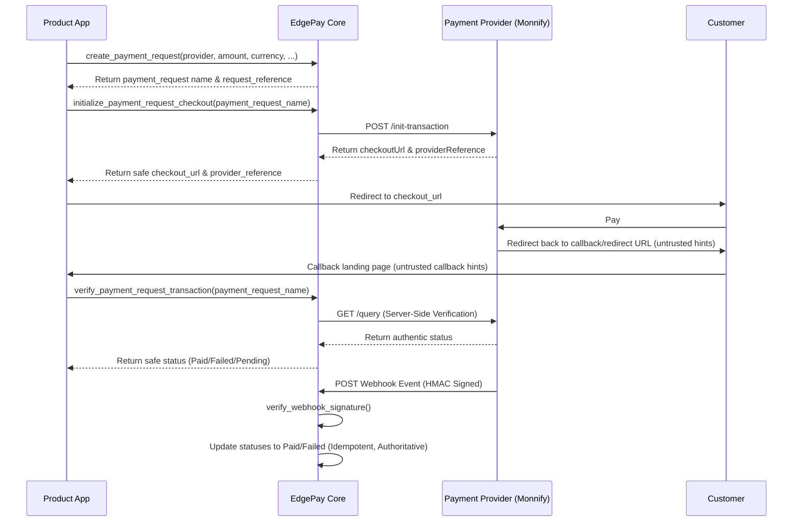

### EdgePay

Universal payment orchestration layer for Frappe, ERPNext, POSnext, and EdgeSuite apps

### Installation

You can install this app using the [bench](https://github.com/frappe/bench) CLI:

```bash
cd $PATH_TO_YOUR_BENCH
bench get-app $URL_OF_THIS_REPO --branch develop
bench install-app edgepayv1
```

### Contributing

This app uses `pre-commit` for code formatting and linting. Please [install pre-commit](https://pre-commit.com/#installation) and enable it for this repository:

```bash
cd apps/edgepayv1
pre-commit install
```

Pre-commit is configured to use the following tools for checking and formatting your code:

- ruff
- eslint
- prettier
- pyupgrade
### CI

This app can use GitHub Actions for CI. The following workflows are configured:

- CI: Installs this app and runs unit tests on every push to `develop` branch.
- Linters: Runs [Frappe Semgrep Rules](https://github.com/frappe/semgrep-rules) and [pip-audit](https://pypi.org/project/pip-audit/) on every pull request.


mit

---

### Developer Documentation

#### 1. Execution Modes: Simulated vs. Sandbox vs. Live
* **Simulated Mode (Default in Tests)**: Uses `SimulatedMonnifyClient` to return mock success/pending responses instantly. No network connections are initiated.
* **Sandbox Mode**: Executes network requests against Monnify's sandbox endpoints (`https://sandbox.monnify.com/api`). Requires sandbox credentials and live-call gating enabled.
* **Live Mode**: Executes network requests against Monnify's production endpoints (`https://api.monnify.com/api`). Requires live credentials and live-call gating enabled.

#### 2. Live-Provider-Call Gating
To prevent accidental external calls, a strict multi-tier gating system is enforced:
1. `EdgePay Settings` -> `Enable EdgePay` must be Checked.
2. `EdgePay Settings` -> `Allow External HTTP Calls` must be Checked (Defaults to Unchecked/Disabled).
3. The specific `EdgePay Provider` must be enabled.
4. Credentials (`api_key` and `secret_key`) must be configured on the provider.
If any gating check fails, the live client throws a validation error immediately.

#### 3. Authentication Caching
Bearer tokens obtained via Basic Auth POST request to `/v1/auth/login` are cached in Redis via `frappe.cache()`.
* Cache keys are hashed and unique to the provider name and credential pair.
* Tokens are cached with a **5-minute safety buffer** subtracted from the provider-returned `expiresIn` duration.
* Expired tokens are refreshed transparently on the next request.
* Tokens are never stored in the database, logged, or returned in whitelisted APIs.

#### 4. Safety Warnings & Tests
* **No Network Calls in Tests**: All unit tests run with `allow_external_http_calls` disabled by default. Live integration tests patch out the `requests` library to ensure network requests are never sent.
* **Accounting & Fulfillment Excluded**: Real transactions do NOT mutate ERPNext/accounting records (e.g. Sales Invoices, Journal Entries, GL Entries) in this infrastructure layer. Any automatic accounting mutations must wait for subsequent connector phases.

#### 5. Required Monnify Configuration
- **API Key**: Found on the Monnify dashboard. Saved securely as a `Password` field.
- **Secret Key**: Found on the Monnify dashboard. Saved securely as a `Password` field.
- **Contract Code**: Monnify contract code (required for live/sandbox calls).
- **Webhook Signature**: Webhook secret / signature validation configuration computed locally using HMAC-SHA512.

#### 6. Monnify Sandbox Smoke Test Utility
Developers can trigger a live connectivity verification command against Monnify Sandbox endpoints to test authentication, checkout initialization, and transaction verification:
```bash
EDGEPAY_RUN_MONNIFY_SANDBOX_SMOKE=1 EDGEPAY_MONNIFY_SANDBOX_API_KEY=your_sandbox_api_key EDGEPAY_MONNIFY_SANDBOX_SECRET_KEY=your_sandbox_secret_key EDGEPAY_MONNIFY_SANDBOX_CONTRACT_CODE=your_sandbox_contract_code bench --site posnext.local execute edgepayv1.edgepay.tools.monnify_sandbox_smoke.run_monnify_sandbox_smoke
```
> [!WARNING]
> **Security Gating**: Real credentials must never be committed to repository files, tests, JSON fixtures, docs, or screenshots. The utility automatically enables live calls temporarily and restores configurations to safe defaults in a `finally` block.

#### 7. API Contract & Lifecycle Flows

##### Lifecycle Flow Diagram
The complete Payment lifecycle consists of four main steps:
1. **Create Payment Request**: The product app calls `create_payment_request` to get a standardized request reference.
2. **Initialize Checkout**: The user is redirected to the returned `checkout_url`.
3. **Verify Transaction**: Once the redirect completes, the client app calls `verify_payment_request_transaction` to check status server-side.
4. **Webhook Processing**: Authoritative asynchronous confirmation via `process_provider_webhook`.



##### API Methods

###### `create_payment_request` (Authenticated Only)
Creates a Payment Request and returns safe fields only.
* **Arguments**:
  - `provider` (string, e.g. `"Test Provider"`)
  - `amount` (float, e.g. `2500.00`)
  - `currency` (string, e.g. `"NGN"`)
  - `customer_name` (string)
  - `customer_email` (string)
  - `customer_phone` (string, optional)
  - `payment_purpose` (string, optional)
  - `source_app` (string, optional)
  - `source_doctype` (string, optional)
  - `source_name` (string, optional)
  - `expires_on` (datetime, optional)
  - `metadata_json` (JSON string/dict, optional)
  - `idempotency_key` (string, optional)
* **Response**:
  ```json
  {
    "ok": true,
    "status": "success",
    "message": "Payment request created successfully",
    "data": {
      "payment_request": "EP-PRQ-2026-00054",
      "request_reference": "REQ-ABC123XYZ456",
      "status": "Draft",
      "amount": 2500.0,
      "currency": "NGN",
      "provider": "Test Provider",
      "expires_on": "2026-06-12 23:59:59"
    }
  }
  ```

###### `initialize_payment_request_checkout` (Authenticated Only)
Initializes checkout and generates provider parameters.
* **Response**:
  ```json
  {
    "ok": true,
    "status": "success",
    "message": "Checkout initialized successfully",
    "data": {
      "payment_request": "EP-PRQ-2026-00054",
      "status": "Initiated",
      "checkout_url": "https://sandbox.monnify.com/checkout/REQ-ABC123XYZ456",
      "provider_reference": "MON-REQ-ABC123XYZ456-TX",
      "expires_on": "2026-06-12 23:59:59"
    }
  }
  ```

###### `verify_payment_request_transaction` (Authenticated Only)
Performs server-side query to the provider and updates request status.
* **Response**:
  ```json
  {
    "ok": true,
    "status": "success",
    "message": "Transaction verified successfully",
    "data": {
      "payment_request": "EP-PRQ-2026-00054",
      "request_status": "Paid",
      "transaction": "EP-TXN-2026-00009",
      "transaction_status": "Success",
      "provider_reference": "MON-REQ-ABC123XYZ456-TX",
      "amount": 2500.0,
      "currency": "NGN",
      "paid_on": "2026-06-12 22:58:39"
    }
  }
  ```

###### `handle_checkout_callback` (Guest Accessible)
Safe callback/redirect handler. Treats query parameters as untrusted hints.
* **Response**:
  ```json
  {
    "ok": true,
    "status": "success",
    "message": "Callback processed successfully",
    "data": {
      "payment_request": "EP-PRQ-2026-00054",
      "status": "Paid",
      "message": "Payment verified successfully"
    }
  }
  ```

##### Security Best Practices
* **Callbacks are not Proof of Payment**: Redirect/callback parameters are untrusted user input. Do not trust them alone. Always run server-side verification (`verify_payment_request_transaction`) or wait for the signed webhook event before marking any order or invoice as fulfilled.
* **Authoritative Actions**: Webhooks and server-side verification are the only authoritative ways to resolve payment status.
* **Accounting Mutations**: All accounting and ledger mutations (like creating Sales Invoice payment entries or Journal Entries) are explicitly excluded from the EdgePay core orchestration layer and are handled in downstream app-specific connectors.
* **Do Not Log or Commit Credentials**: Never save or print API keys, secret keys, or bearer tokens in code, test files, logs, database payloads, or git commits. Use Password fields or redacted structures at all times.

#### 8. Connector Layer Foundation

The connector layer acts as a decoupled interface mapping source documents to EdgePay Payment Requests without hard imports or dependencies on product apps like ERPNext, POSnext, RetailEdge, VetEdge, or CoreEdge.

##### Dynamic Handoff Architecture
1. **Source Context Input**: Product apps build a `source_context` dictionary payload.
2. **Connector Registry**: Resolves the correct app connector using `get_connector(source_app)`. Defaults to `GenericSourceConnector` for unregistered apps.
3. **Payload Mapping**: Standardizes details into an EdgePay payload.
4. **Idempotent Creation**: `create_payment_request_from_source` is invoked to create or retrieve the request.
5. **Status Update Dispatcher**: The internal `notify_source_payment_status` event notifier calls back to the app connector. In this phase, the generic fallback logs safe messages only without muting source documents.

##### Example `source_context` Payload
```json
{
  "provider": "Monnify Sandbox Smoke Test",
  "source_app": "RetailEdge",
  "source_doctype": "Sales Invoice",
  "source_name": "SINV-2026-0001",
  "amount": 3000.0,
  "currency": "NGN",
  "customer_name": "John Doe",
  "customer_email": "john.doe@example.com",
  "customer_phone": "+2348000000000",
  "payment_purpose": "Invoice Payment SINV-2026-0001",
  "idempotency_key": "idemp_invoice_key_777",
  "metadata_json": {
    "custom_reference": "ref-1002"
  }
}
```

##### API Method

###### `create_payment_request_from_source(source_context)` (Authenticated Only)
Creates or returns an active Payment Request from the generic source payload.
* **Response**:
  ```json
  {
    "ok": true,
    "status": "success",
    "message": "Payment request created successfully",
    "data": {
      "payment_request": "EP-PRQ-2026-00054",
      "request_reference": "REQ-ABC123XYZ456",
      "status": "Draft",
      "amount": 3000.0,
      "currency": "NGN",
      "provider": "Monnify Sandbox Smoke Test",
      "expires_on": null
    }
  }
  ```

##### Decoupling Rules & Constraints
* **No Direct Imports**: EdgePay does not import any module from ERPNext, POSnext, RetailEdge, VetEdge, or CoreEdge. Custom app connectors extend `BaseSourceConnector` and register themselves using `register_connector(app_name, connector_instance)`.
* **Safe Status Update**: The Generic Connector handler `handle_payment_status_update` logs a safe operational message. It does not perform ledger entries, journal entries, or update status fields on the source document itself in this core phase.
* **No Expose of Source Internals**: API responses never leak internal document structures or raw metadata unless explicitly sanitized. All payloads are recursively redacted.

#### 9. EdgePay Connector SDK Reference

Product apps should not call whitelisted API methods directly or interact with database documents. Instead, they must interact via the stable internal SDK functions exposed in `edgepayv1.edgepay.sdk`.

##### SDK Import and Initialization
```python
from edgepayv1.edgepay import sdk
```

##### SDK Functions

###### `sdk.create_source_payment_request(source_context)`
Wraps payment request creation. Validates context against the appropriate profile.
* **Arguments**: `source_context` (dict)
* **Returns**: Safe normalized dict `{ "ok": bool, "status": str, "message": str, "data": dict }`

###### `sdk.initialize_source_checkout(payment_request_name)`
Initializes the checkout session for a payment request.
* **Arguments**: `payment_request_name` (str)
* **Returns**: Safe normalized dict with `checkout_url` and `provider_reference`.

###### `sdk.verify_source_payment(payment_request_name)`
Performs authoritative server-side verification and logs transaction records.
* **Arguments**: `payment_request_name` (str)
* **Returns**: Safe status details, paid date, amount, currency, and provider references.

###### `sdk.get_source_payment_status(payment_request_name)`
Read-only wrapper to check payment request status without database mutation.
* **Arguments**: `payment_request_name` (str)
* **Returns**: Current payment request status fields.

###### `sdk.get_source_transaction_status(payment_request_name=None, provider_reference=None, transaction_reference=None)`
Read-only wrapper to query transaction status by reference fields. Does not mutate records.
* **Arguments**: Optional parameters to filter transaction records.
* **Returns**: Safe transaction status fields.

##### SDK Integration Lifecycle Flow
1. **Create Request**: Host app builds `source_context` and calls `sdk.create_source_payment_request(source_context)`.
2. **Initialize Checkout**: Host app calls `sdk.initialize_source_checkout(payment_request_name)`.
3. **Redirect**: Host app redirects customer to the returned `checkout_url`.
4. **Authoritative Verification**: Upon redirect return, or asynchronous webhook execution, EdgePay verifies transaction status server-side.
5. **Handoff Notification**: EdgePay builds a safe handoff payload and calls the registered app's connector `handle_payment_status_update` hook.
6. **Fulfillment / Ledger Entry**: The host app's connector intercepts the handoff notification and performs its own order updates and accounting mutations in its own package context.

##### Example `source_context` Payloads for Product Apps

###### ERPNext
```python
{
  "source_app": "erpnext",
  "source_doctype": "Sales Invoice",
  "source_name": "ACC-SINV-2026-0001",
  "amount": 125000.00,
  "currency": "NGN",
  "customer_name": "Acme Corp",
  "customer_email": "billing@acme.com",
  "customer_phone": "+2348011112222",
  "payment_purpose": "Invoice Payment ACC-SINV-2026-0001",
  "idempotency_key": "idemp_erpnext_invoice_10023",
  "metadata": {"project_id": "PRJ-901"}
}
```

###### POSnext
```python
{
  "source_app": "posnext",
  "source_doctype": "POS Invoice",
  "source_name": "POS-INV-2026-00045",
  "amount": 15450.00,
  "currency": "NGN",
  "customer_name": "Jane Doe",
  "customer_email": "jane.doe@posnext.local",
  "customer_phone": "+2348033334444",
  "payment_purpose": "POS Checkout POS-INV-2026-00045",
  "idempotency_key": "idemp_posnext_invoice_77812",
  "metadata": {"pos_profile": "Main Register"}
}
```

###### RetailEdge
```python
{
  "source_app": "retailedge",
  "source_doctype": "Sales Invoice",
  "source_name": "SINV-2026-092",
  "amount": 9500.00,
  "currency": "NGN",
  "customer_name": "Alice Smith",
  "customer_email": "alice@retailedge.com",
  "customer_phone": "+2348055556666",
  "payment_purpose": "Retail Store Checkout SINV-2026-092",
  "idempotency_key": "idemp_retailedge_sales_invoice_092",
  "metadata": {"store_id": "Lagos-Main"}
}
```

###### VetEdge
```python
{
  "source_app": "vetedge",
  "source_doctype": "Clinical Consultation",
  "source_name": "CLINIC-CON-2026-4421",
  "amount": 42000.00,
  "currency": "NGN",
  "customer_name": "Dr. Dog Lover",
  "customer_email": "petowner@vetedge.com",
  "customer_phone": "+2348077778888",
  "payment_purpose": "Veterinary Consultation CLINIC-CON-2026-4421",
  "idempotency_key": "idemp_vetedge_clinic_con_4421",
  "metadata": {"pet_name": "Rex", "pet_type": "Canine"}
}
```

###### Generic Fallback App
```python
{
  "source_app": "edgesuite",
  "source_doctype": "Custom Order",
  "source_name": "ORD-1234",
  "amount": 50000.00,
  "currency": "NGN",
  "customer_name": "EdgeSuite User",
  "customer_email": "user@edgesuite.com",
  "customer_phone": "+2348099990000",
  "payment_purpose": "Service Payment ORD-1234",
  "idempotency_key": "idemp_edgesuite_ord_1234",
  "metadata": {}
}
```


